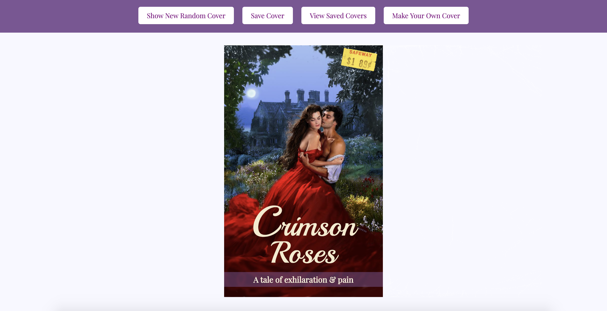

# RomCom

Romcom is a website that can generate random romantic novel covers from a pre-existing database, and can also allow users to input their own information to make custom covers and add to the database. Users can save covers to a collection, display that collection by toggling different page views, and delete covers from their collection by double-clicking on them.

This project was the first paired-programming project for Turing School of Software and Design's Front-End-Engineering program in Mod 1 of the 2005 inning. The project was designed to get us familiar with with using object-oriented-programming, querySelectors(), eventListeners, and linking between JavaScript, HTML and CSS files while using git and Github for branching and version control.

### Functionality and application:

* From the homepage, users can click the "Show New Random Cover" button, and the website will pull a random cover image, title, and two random descriptors from a pre-existing database to be displayed on screen as a romantic novel cover.

* If the user likes this particular cover, they can click "Save Cover" to add it to a collection of saved covers. If the cover has already been saved, it will not be saved again. They can look at their collection by clicking "View Saved Covers" which will take them to a page displaying all of their saved covers.

* If a user would like to make their own cover, they can do so by navigating to the "Make Your Own Cover" section, input a link to a cover image, a title, and two descriptors into the form, and click "Make My Cover".

*  When the "Make My Cover" button is clicked, the cover-image, title, and descriptors will be added to the database for use with future random covers, and they will be taken to the home screen where their new cover is displayed. 

* The user can then click "Save Cover" and the new cover will be saved in the "View Saved Covers" section, and can be viewed by switching to that section.

* A user can remove a cover from the collection by double clicking on the cover they would like to remove.
